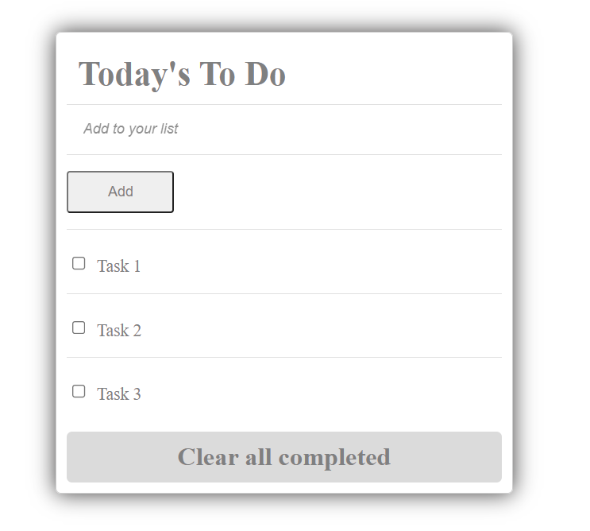

# Building a "To-do list" website

Tasks to do:

- Project 1: List structure.
- Project 2: Interactive list.
- Project 3: Add and remove items.

## Live demo

You can visit live version via [link](https://elmar8287.github.io/todo-list/)

## Built With

- HTML
- CSS
- JS
- webpack
- JSON

## Authors

👤 **Elmar Abdulkarimov**

- GitHub: [@elmar8287](https://github.com/elmar8287)

## 🤝 Contributing

Contributions, issues, and feature requests are welcome!

Feel free to check the [issues page](../../issues/).

## Show your support

Give a ⭐️ if you like this project!

## Acknowledgments

The project personalized for my  purposes. See the MIT.md file

## 📝 License

This project is [MIT](./MIT.md) licensed.
